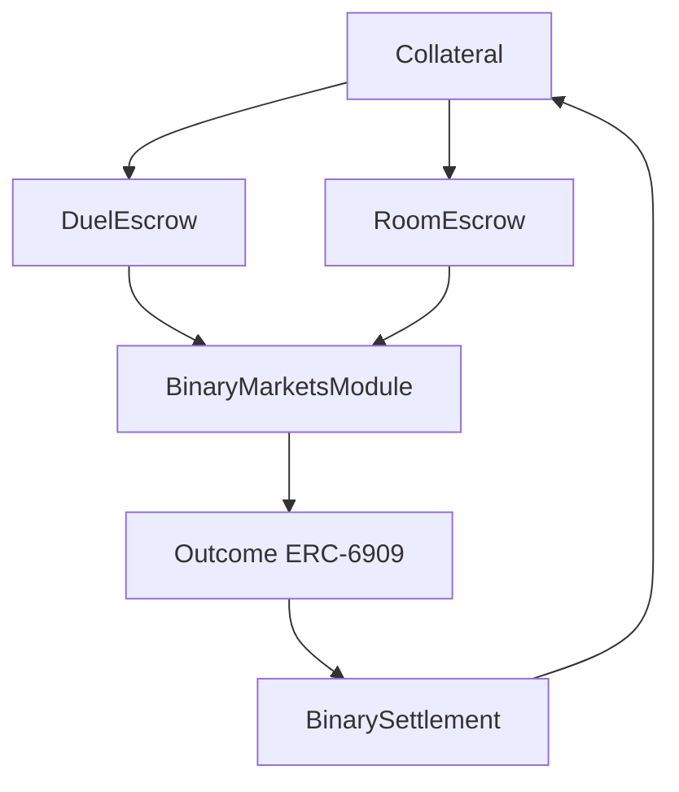

# Smart contract architecture

> How `DuelEscrow` and `RoomEscrow` use DreamDEX complete-set minting to create social event-contract products.

Trade Rush contracts are intentionally small: no upgradeability, no admin, no pause, and no fee path. They exist to escrow stakes, mint complete sets, split outcome legs, and keep unmatched or one-sided funds refundable.

## Contract ecosystem

## Contract summary

### DuelEscrow

Equal-stake challenges.

| Property | Value |
| --- | --- |
| Parties | 2 |
| Stake model | Equal stake per side |
| Mint timing | On accept |
| Complete sets minted | `2S` |
| Refund path | `cancel()` for unmatched challenges |

### RoomEscrow

Many-player rooms.

| Property | Value |
| --- | --- |
| Parties | Many |
| Stake model | Any size, either side |
| Mint timing | Per join |
| Payout model | Parimutuel |
| Refund path | `refund()` for one-sided rooms |

## Tradeability checks

The DreamDEX module does not expose the status enum the original brief described. Trade Rush derives tradability from chain time and the market record returned by `markets()`.

| Check | Source |
| --- | --- |
| Collateral | `markets(marketId).collateral` |
| Operator | `markets(marketId).operatorId` |
| Venue | `markets(marketId).venueId` |
| Outcome IDs | `markets(marketId).yesId` / `noId` |
| Window | `tradingStart <= block.timestamp < expiry` |

## Settlement

Winners redeem through `BinarySettlement.redeem(outcomeId, amount, to)`. This matters because the module-level redeem path was not the working finalized-market path in live testing.

<Warning>
  Contracts are unaudited. The repository is testnet-first and should not be used with real funds without review.
</Warning>
