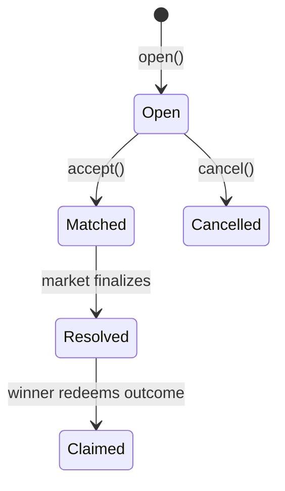

# Duels

> Two-player equal-stake challenges on top of DreamDEX Event Contracts.

A duel is the most direct social primitive in Trade Rush: one player opens a challenge, shares a link, and another player accepts with the same stake on the opposite side.

## Flow

## Pot arithmetic

Each side stakes `S`.

| Value | Formula |
| --- | --- |
| Challenger stake | `S` |
| Opponent stake | `S` |
| Pot | `2S` |
| Complete sets minted | `2S` |
| Winner redemption | `2S` |

<Warning>
  Minting only `S` complete sets is wrong. It pays the winner half the pot and strands the rest.
</Warning>

## Contract behavior

| Step | Contract action |
| --- | --- |
| `open()` | Pulls challenger stake and stores the challenge |
| `accept()` | Pulls opponent stake, reads market state, mints `2S` complete sets, and transfers opposite legs |
| `cancel()` | Refunds an unmatched challenge |

## Guards

| Guard | Reason |
| --- | --- |
| `StakeZero` | Empty challenges are invalid |
| `SelfDuel` | Challenger cannot accept their own duel |
| `DeadlineTooLate` | Accept deadline must leave a 30 second margin before expiry |
| `WrongCollateral` | Market collateral must match the escrow's collateral |
| `MarketNotTrading` | The market must be inside its trading window |
