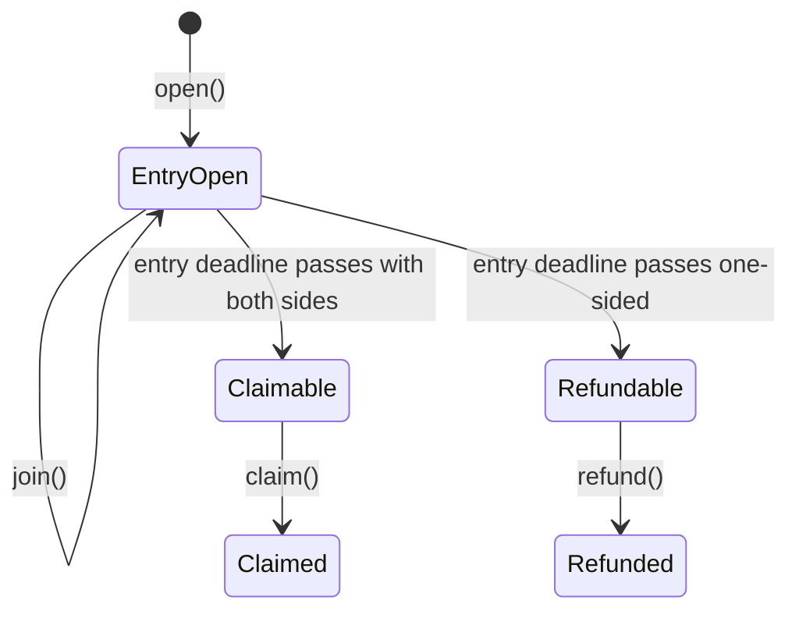

# Rooms

> Many-player parimutuel pots for event-contract markets.

Rooms solve the problem an order book cannot: a group of users can take sides without needing a maker or exact counterparty match. Everyone stakes into one pot. The winning side splits the full pot by contribution.

## Flow

## Payout model

| Example | Up side | Down side | If Up wins | If Down wins |
| --- | --- | --- | --- | --- |
| Balanced | 5 | 5 | Up gets 2.0x | Down gets 2.0x |
| Uneven | 5 | 3 | Up gets 1.6x | Down gets 2.67x |

The contract mints complete sets per join. After entry closes, every participant can claim their share of their side's outcome tokens. The winning outcome redeems against the pot.

## One-sided rooms

A room with only one side cannot pay a winner because there is no opposing stake. Trade Rush handles this by merging complete sets back into collateral and refunding participants.

## Contract behavior

| Function | Purpose |
| --- | --- |
| `open()` | Creates a room and takes the first stake |
| `join()` | Adds a stake to either side before entry closes |
| `claim()` | Sends a participant's proportional outcome-token share |
| `refund()` | Returns collateral for one-sided rooms |
| `shareOf()` | Previews claimable outcome-token amounts |
