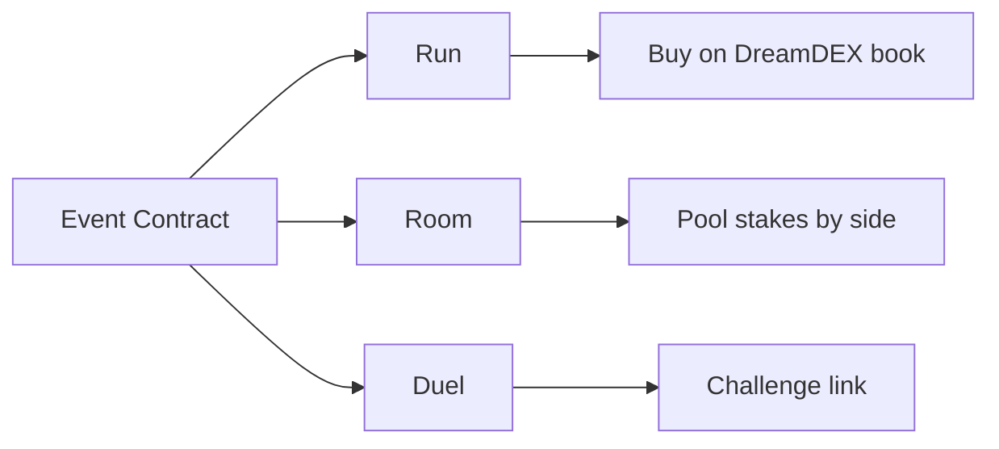

> ## Documentation Index
> Fetch the complete documentation index at: /llms.txt
> Use this file to discover all available pages before exploring further.

# Trade Rush

> Three ways to take a side of a DreamDEX Event Contract, wrapped in a handheld-console trading game.

Trade Rush is a Somnia x DreamDEX Event Contracts hackathon project. It turns binary event-contract trading into three concrete paths: instant book trading, many-player parimutuel rooms, and two-player duels with equal stakes and winner-takes-pot settlement.

## The core transformation

| Event-contract primitive | Trade Rush experience |
| --- | --- |
| Binary market | Console stage |
| Buy or sell outcome | Run with Up or Down |
| Complete-set minting | Pot-backed challenge |
| Settlement and redeem | Claim the winning side |

Trade Rush keeps the financial action on DreamDEX primitives while changing the product surface. A market is no longer only an order book row; it becomes a challenge, a room, or a quick run where the player can take a side without needing to understand every protocol edge case first.

## Explore the docs

<CardGroup cols={2}>
  <Card title="Problem statement" icon="triangle-alert" href="/introduction/problem">
    Why event contracts need a sharper product layer for real users.
  </Card>

  <Card title="Our solution" icon="lightbulb" href="/introduction/solution">
    How Trade Rush combines book orders, rooms, duels, and claim-first settlement.
  </Card>

  <Card title="How it works" icon="route" href="/overview/how-it-works">
    The player journey from market discovery to settlement.
  </Card>

  <Card title="Smart contracts" icon="file-code" href="/contracts/overview">
    The escrow contracts behind duels and rooms.
  </Card>
</CardGroup>

## Triple product stack

<CardGroup cols={3}>
  <Card title="Market layer" icon="chart-candlestick">
    Live DreamDEX Event Contracts on Somnia Shannon testnet and Somnia mainnet.
  </Card>

  <Card title="Game layer" icon="gamepad-2">
    A handheld-console interface for runs, rooms, and direct challenges.
  </Card>

  <Card title="Settlement layer" icon="badge-check">
    Escrows mint complete sets, split outcome legs, and let winners claim through settlement.
  </Card>
</CardGroup>

## Key features

| Feature | Description |
| --- | --- |
| **Run** | Take a side through the venue book with tick, lot, and expiry guards |
| **Rooms** | Many players stake any size into one pot; winning side splits the pot by contribution |
| **Duels** | Two players stake equal amounts; winner redeems the full pot |
| **Live reads** | The SDK reads event-contract markets from the indexer and checks critical state on-chain |
| **Network switching** | `NETWORK=testnet` or `NETWORK=mainnet` moves chain, collateral, venue, RPC, and decimals together |

## Platform at a glance

| Metric | Value |
| --- | --- |
| Hackathon | Event Contracts Hackathon by Somnia x DreamDEX |
| Primary network | Somnia Shannon Testnet |
| Testnet chain ID | `50312` |
| Mainnet chain ID | `5031` |
| Testnet collateral | tUSDC, 6 decimals |
| Mainnet collateral | USDso, 18 decimals |
| Contracts | `DuelEscrow`, `RoomEscrow` |
| Frontend | Vite, React, Privy, viem |

## Smart contracts

Trade Rush uses two intentionally small escrow contracts.

| Contract | Purpose |
| --- | --- |
| `DuelEscrow` | Opens one-on-one challenges, mints `2S` complete sets on accept, and sends one outcome leg to each player |
| `RoomEscrow` | Lets many players join either side, mints per join, then distributes each side's outcome tokens by stake share |

<Warning>
  Trade Rush is unaudited and testnet-first. Do not point it at real funds without a security review.
</Warning>

## Quick links

<CardGroup cols={2}>
  <Card title="Repository" icon="github" href="https://github.com/">
    Source code, contracts, SDK, scripts, and frontend.
  </Card>

  <Card title="Hackathon" icon="trophy" href="https://dorahacks.io/hackathon/event-contracts">
    Event Contracts Hackathon on DoraHacks.
  </Card>

  <Card title="Findings" icon="search-check" href="/resources/hackathon-notes">
    Live-venue corrections discovered during build.
  </Card>

  <Card title="API integration" icon="plug" href="/technical/api-integration">
    SDK and contract examples for integrating with Trade Rush.
  </Card>
</CardGroup>

<Info>
  **Run. Room. Duel. Claim.** Built for the Event Contracts Hackathon.
</Info>
