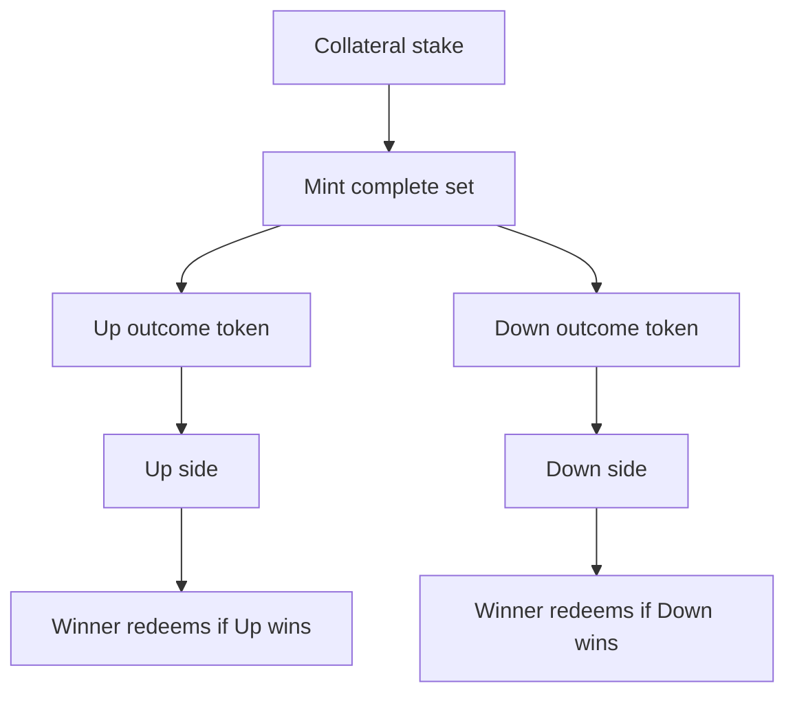

# Our solution

> Trade Rush adds product primitives on top of DreamDEX Event Contracts: run on the book, pool in a room, or challenge through a duel.

Trade Rush does not replace DreamDEX. It builds around it. The system reads live markets, guards writes against chain state, and uses complete-set minting to create game-native experiences that do not require a matching counterparty.

## Three modes

| Mode | User action | Protocol action |
| --- | --- | --- |
| Run | Pick Up or Down from the console | Submit a guarded book order |
| Room | Join either side of a shared pot | Mint complete sets per stake and split outcome legs by side |
| Duel | Send or accept a challenge link | Escrow equal stakes and mint `2S` complete sets on accept |

## Why this works

Complete-set minting turns collateral into both outcome legs. Trade Rush uses that primitive differently depending on mode.

For a duel, each player stakes `S`. The escrow mints `2S` complete sets, sends one side `2S` of Up and the other side `2S` of Down, and the winning leg redeems the whole pot.

For a room, every join mints complete sets immediately. Once entry closes, each side receives its proportional share of that side's outcome tokens. The side that wins redeems against the full pot.

## Design principles

| Principle | Implementation |
| --- | --- |
| Chain state before writes | Escrows call `markets()` immediately before minting |
| No hardcoded decimals | Network config carries collateral decimals |
| No stranded unmatched challenges | Unaccepted duels are cancellable and refundable |
| No fake settlement copy | Result screens lead with claim/redeem |
| No backend dependency for core protocol | Escrows and SDK carry the financial path |

## Hackathon fit

The Event Contracts Hackathon is about accelerating adoption of Event Contracts. Trade Rush focuses on adoption through a usable surface: social challenges, group pots, readable settlement, and a console interaction model that makes a binary market feel concrete.
