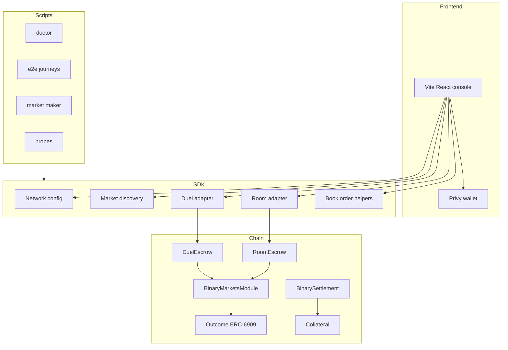

# System architecture

> A breakdown of the frontend, SDK, scripts, and smart contracts that power Trade Rush.

Trade Rush has four layers: frontend, SDK, automation scripts, and Solidity escrows.

## Frontend layer

| Component | Function |
| --- | --- |
| `apps/web` | Vite React console |
| `ConsoleApp` | Main game shell |
| `ScreenRooms` | Room creation and joining |
| `ScreenDuels` | Duel creation, lobby, accept, result |
| `walletContext` | Privy and wallet-client integration |

## SDK layer

| Module | Function |
| --- | --- |
| `config.ts` | Loads network and environment config |
| `networks.ts` | Maps testnet/mainnet chain IDs, collateral, decimals, RPCs, and protocol addresses |
| `discovery.ts` | Reads live binary markets from the indexer |
| `market.ts` | Normalizes market state and book-facing helpers |
| `duel.ts` | Client adapter for `DuelEscrow` |
| `room.ts` | Client adapter for `RoomEscrow` |
| `ticks.ts` | Snaps prices, sizes, deadlines, and expiry values |

## Smart contract layer

| Contract | Function |
| --- | --- |
| `DuelEscrow` | Equal-stake peer-to-peer challenge escrow |
| `RoomEscrow` | Many-player parimutuel room escrow |
| `BinaryMarketsModule` | DreamDEX module for complete-set minting and market records |
| `BinarySettlement` | Redeem path for finalized winning outcome tokens |
| ERC-6909 outcome token | Holds Up and Down outcome balances |

## Automation layer

| Script | Function |
| --- | --- |
| `pnpm doctor` | Verifies addresses, collateral decimals, and live market discovery |
| `pnpm e2e` | Runs a duel end to end on live testnet |
| `pnpm e2e:room` | Runs a room flow on live testnet |
| `pnpm e2e:book` | Runs a book-trading flow |
| `pnpm probe` | Answers protocol unknowns |
| `pnpm maker` | Posts and refreshes two-sided quotes |
