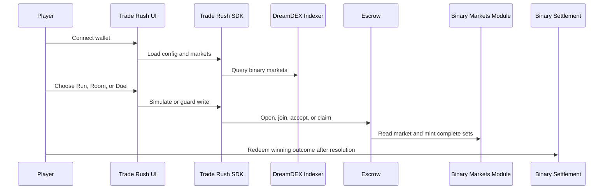

# How Trade Rush works end to end

> Walk through the full player journey from market discovery to claim.

## Journey overview

## 1. Connect

Users connect through Privy. The frontend receives a viem `WalletClient`, so the rest of the app does not need to know whether the user arrived through email, social login, an embedded wallet, or an injected wallet.

## 2. Discover markets

Event-contract markets are discovered through the Somnia Markets indexer via `@somnia-chain/markets-sdk`. The REST `/v0/markets` venue endpoint is used for spot/perp data, not event contracts.

## 3. Pick a path

<CardGroup cols={3}>
  <Card title="Run" icon="person-running">
    Buy on the DreamDEX book with tick, lot, expiry, and IOC-style taker guards.
  </Card>

  <Card title="Room" icon="users">
    Stake any size on either side. The winning side splits the pot by contribution.
  </Card>

  <Card title="Duel" icon="swords">
    Stake equal amounts, share a link, and let the winner claim the full pot.
  </Card>
</CardGroup>

## 4. Guard the write

Trade Rush checks the state that matters before signing.

| Check | Why |
| --- | --- |
| Chain ID | Testnet and mainnet links must not cross |
| Collateral decimals | Testnet tUSDC uses 6 decimals; mainnet USDso uses 18 |
| Market window | Writes close before expiry, not exactly at expiry |
| Market collateral | Escrow only accepts the configured collateral |
| Tick and lot | Book orders snap to the venue grid |

## 5. Settle and claim

Settlement does not land by itself. A resolved winning outcome must be redeemed. Trade Rush keeps this explicit: the result view tells the winner what they can claim and gives them the action to claim it.
