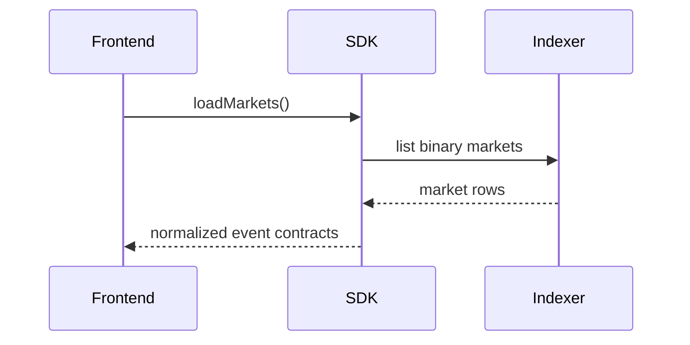
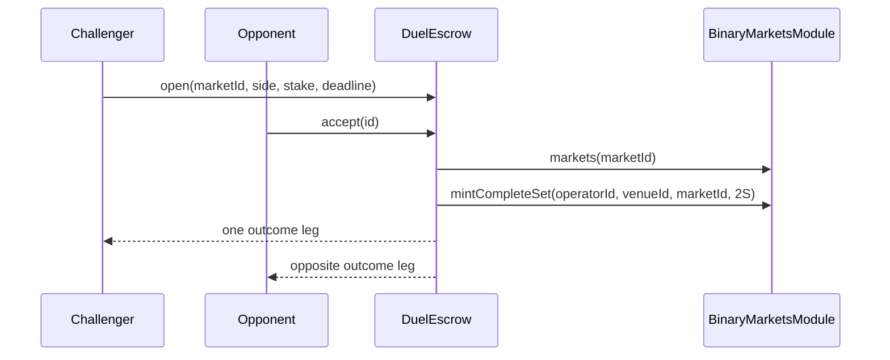
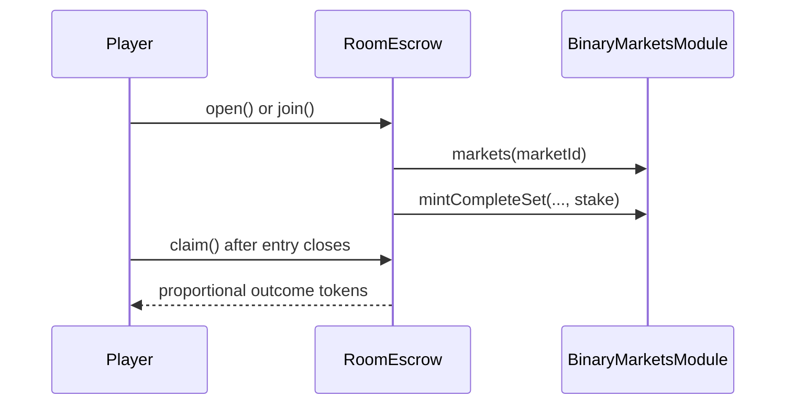
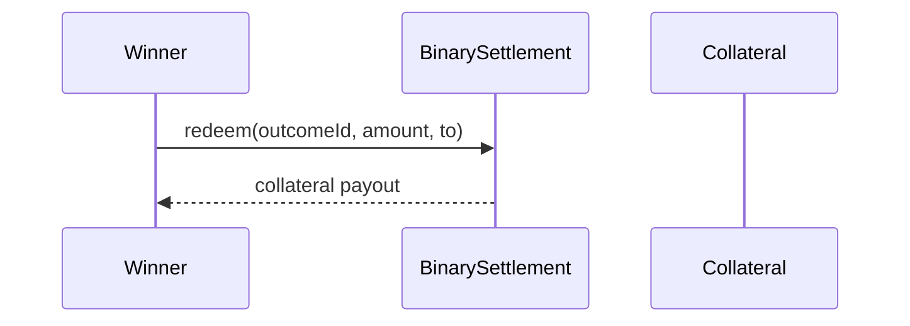

# System flow

> How data and transactions move through Trade Rush.

## Market discovery

Event contracts are discovered from the indexer, not the spot/perp REST registry.

## Duel flow

## Room flow

## Settlement flow

Settlement is explicit. A winning position does not automatically become collateral in the wallet.
